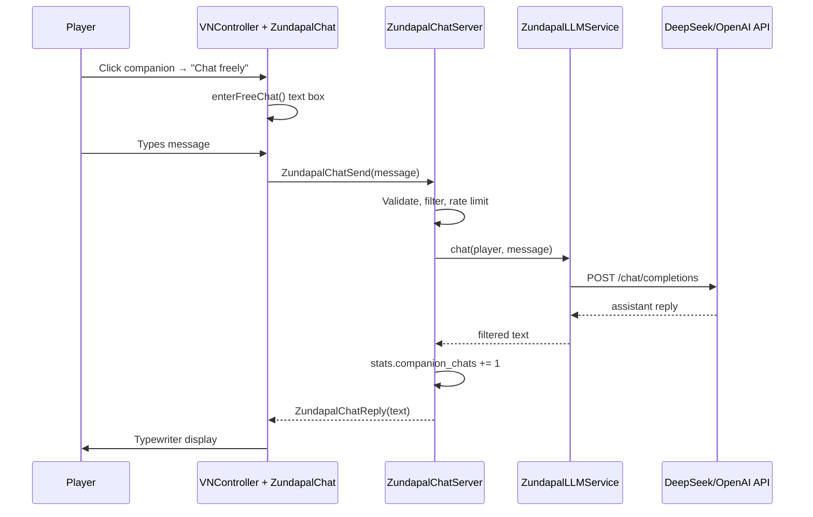

# Zundapal LLM Companion — Design & Implementation Plan

**Status:** Phase 1 implemented (server proxy + free-chat UI)  
**Date:** July 2026  
**Goal:** Extended, open-ended conversations with Zundapal powered by an external LLM, while keeping scripted VN for quests, zones, and tutorials.

---

## 1. Design principles

| Principle | Rationale |
|-----------|-----------|
| **Hybrid dialogue** | Scripted trees for onboarding/quests; LLM for free chat |
| **Server-only API** | API keys never touch the client |
| **Filtered text** | Roblox `TextService` on player input; moderate output |
| **Rate limited** | Per-player cooldown + max message length |
| **Graceful fallback** | If API key missing or request fails, Zundapal uses canned lines |
| **In-character** | System prompt locks Zundapal persona + game facts |

Zundapal is **not** a general-purpose chatbot in-game — she is a cozy kitchen companion who knows Zunda Village lore, recipes, and the player's name.

---

## 2. Architecture

### Files (Phase 1)

| File | Role |
|------|------|
| `ConfigurationFiles/ZundapalLLMConfig.lua` | Model, limits, system prompt (no secrets) |
| `Services/ZundapalLLMService.lua` | HttpService, history, API call, fallback |
| `ZundapalChatServer.server.lua` | Remote handlers, validation |
| `ZundapalChat.client.lua` | Send/receive wiring |
| `VNController.client.lua` | Free-chat UI + menu entry |

### Remotes

| Name | Direction | Payload |
|------|-----------|---------|
| `ZundapalChatSend` | C→S | `(message: string)` |
| `ZundapalChatReply` | S→C | `(payload: { text, speaker? })` |
| `ZundapalChatError` | S→C | `(message: string)` |
| `ZundapalChatStatus` | S→C | `(status: "thinking" \| "ready")` |

---

## 3. Studio setup (required for live LLM)

### 3.1 API key (never commit)

1. In Studio: **ServerStorage** → create folder `ZundapalLLMSecrets`
2. Add **StringValue** named `ApiKey` with your DeepSeek or OpenAI key
3. Do **not** sync this folder via Rojo/git

### 3.2 HttpService

1. **Game Settings** → **Security** → enable **Allow HTTP Requests**
2. Add allowed domains:
   - `api.deepseek.com` (DeepSeek)
   - `api.openai.com` (OpenAI, optional)

### 3.3 Provider choice

| Provider | Endpoint | Model example |
|----------|----------|---------------|
| **DeepSeek** | `https://api.deepseek.com/chat/completions` | `deepseek-chat` |
| **OpenAI** | `https://api.openai.com/v1/chat/completions` | `gpt-4o-mini` |

Set `provider` and `model` in [`ZundapalLLMConfig.lua`](../src/ReplicatedStorage/ConfigurationFiles/ZundapalLLMConfig.lua).

---

## 4. Persona & context (system prompt)

The system prompt in `ZundapalLLMConfig` defines:

- **Identity:** Zundapal, supportive pea-spirit companion (🍡)
- **Tone:** Warm, kawaii, emoji-light, encouraging chef partner
- **Knowledge:** Zunda Village, gather → craft → serve loop, key recipes, zones
- **Bounds:** No real-world politics, no Robux scams, no NSFW, stay in game world
- **Length:** 1–3 short paragraphs max per reply

Future Phase 2: inject **live player context** (gold, active quest, zone, inventory summary) into each request.

---

## 5. Security & moderation

| Control | Implementation |
|---------|----------------|
| Input max length | 300 chars (config) |
| Output max length | 600 chars truncated |
| Cooldown | 3s between sends per player |
| Text filter | `TextService:FilterStringAsync` on user message |
| API key | ServerStorage only |
| History cap | 16 messages per session (server memory) |
| Abuse | Silent drop on spam; log to server output |

---

## 6. Phased roadmap

### Phase 1 — MVP (implemented)

- [x] Server LLM proxy + config
- [x] Free-chat entry from companion VN menu
- [x] Text box + typewriter replies
- [x] Fallback when API unavailable
- [x] `companion_chats` stat increment for quest progress

### Phase 2 — Context-aware chat

- [ ] Inject `PlayerDataService` snapshot into system message (gold, quests, zone)
- [ ] Remember last 3 topics per player in DataStore (optional)
- [ ] "Zundapal suggests…" hooks after craft/serve events

### Phase 3 — UX polish

- [ ] Streaming tokens to client (chunked RemoteEvents)
- [ ] Chat history scroll panel in VN UI
- [ ] Typing indicator on companion mesh (sparkle burst)
- [ ] Suggested quick-reply chips ("What should I cook?", "Where are peas?")

### Phase 4 — Production hardening

- [ ] Proxy backend (Cloudflare Worker / AWS Lambda) so API key is off Roblox entirely
- [ ] Per-day message budget per player
- [ ] Moderation layer (second LLM or keyword blocklist)
- [ ] Analytics: latency, error rate, token usage

---

## 7. Cost & ops notes

- DeepSeek is cost-effective for high-volume NPC chat
- Cap `maxTokens` at 256 for MVP
- Monitor usage in provider dashboard
- For public launch, consider **paid servers only** or **daily free message limit** (e.g. 20/day)

---

## 8. Testing checklist

- [ ] No `ApiKey` in Studio → fallback line appears (no HTTP call)
- [ ] Valid key → Zundapal responds in character within ~5s
- [ ] Rapid sends → cooldown error on client
- [ ] Long message → rejected server-side
- [ ] `quest_chat_with_zundapal` progress increases after chats
- [ ] HttpService disabled → fallback, no crash

---

## 9. Related docs

- [`VNDialogueData.lua`](../src/ReplicatedStorage/ConfigurationFiles/VNDialogueData.lua) — scripted lines
- [`zunda-design-bible.md`](../docs/zunda-design-bible.md) — world vocabulary
- [`WORK_QUEUE.md`](WORK_QUEUE.md) — task L1–L3 for follow-up phases
