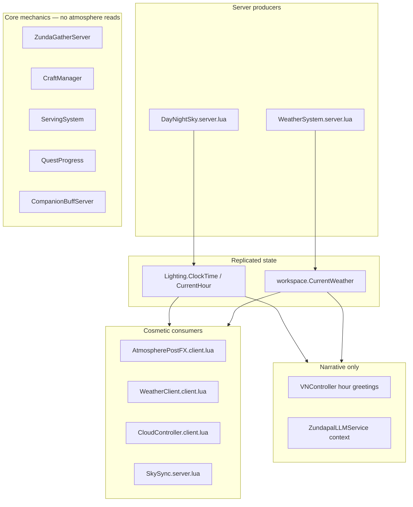

# Atmosphere vs Gameplay Audit

**Date:** July 2026  
**Scope:** How sky, weather, and time-of-day systems interact with core mechanics and LLM narrative.

---

## Summary

Atmosphere in **Zundamon's kItchen** is almost entirely **cosmetic or narrative**. Gather, craft, serve, quests, companion buffs, and economy **do not read** `Lighting` hour or `workspace.CurrentWeather`. Optional mentor chat (Zundapal / Master Chef Zunda) receives hour and weather as **prompt context only** — replies may mention rain or night with no mechanical effect.

---

## Data flow

---

## Layer reference

| Layer | Affects stats? | Key files |
|-------|----------------|-----------|
| Cosmetic lighting / FX | No | `AtmospherePostFX.client.lua`, `WeatherClient.client.lua`, `DayNightSky.server.lua` |
| Planter tint (visual) | No | `SkySync.server.lua` — wetness tint on tagged planters |
| Dialogue flavor | No server enforcement | `VNController.client.lua`, `ZundapalContextBuilder.lua` |
| Core mechanics | **None** | Gather, craft, serve, quests, decoration shop |

---

## Shared time helpers (`SkyConfig.lua`)

Use these instead of duplicating hour bands:

| Helper | Purpose |
|--------|---------|
| `SkyConfig.isNightHour(hour)` | Night band for aurora / weather (19:00–06:59) |
| `SkyConfig.greetingSlot(hour)` | `morning` / `afternoon` / `evening` / `night` for VN |
| `SkyConfig.welcomeGreeting(hour)` | Sign / welcome copy |
| `SkyConfig.weatherWetness(weatherKey)` | 0–1 wetness for planter tint in `SkySync` |

Consumers: `WeatherSystem`, `VNController`, `SkySync`.

---

## Bugs fixed (July 2026)

1. **`SkySync` wetness never applied** — old formula `clamp(fog_mult - 1, 0, 1)` was always zero because all `fog_mult` values are ≤ 1. Replaced with `SkyConfig.weatherWetness()`.
2. **Inconsistent night bands** — unified via `SkyConfig.isNightHour` and `greetingSlot`.
3. **Dead LLM weather fallback** — removed `Lighting:GetAttribute("CurrentWeather")`; weather lives on `workspace` only.
4. **Misleading `SkySync` comment** — updated; gathering pulse was never implemented (cosmetic-only scope).

---

## Studio tuning guide

| Knob | File | Notes |
|------|------|-------|
| Day length | `SkyConfig.cycle.minutes_per_day` | Default 12 real minutes |
| Weather weights | `SkyConfig.weather_weights` | Aurora gated to night in `WeatherSystem` |
| Skybox faces | `SkyConfig.sky.skybox_*` | Paste `rbxassetid://` after upload |
| Keyframe lighting | `SkyConfig.keyframes` | 14 time-of-day rows |

After editing `SkyConfig`, restart play or re-require modules in Studio.

---

## LLM caveat

Mentor chat may **hallucinate** weather or time-based advice (e.g. “gather mushrooms in the rain”). That text is **not backed by game rules**. Scripted VN trees and quest logic are authoritative.

---

## Future work (out of scope)

Weather bonuses in `LootModule` or `CraftManager` would be an explicit design change, not required for publish safety.

See also: [`atmosphere-polish-plan.md`](atmosphere-polish-plan.md), [`environment-audit.md`](environment-audit.md).
