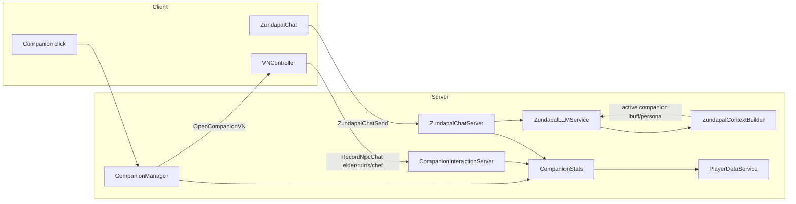

# Companion + LLM Integration Audit

July 2026 — verifies design/asset hooks align with Zundapal LLM and quest systems.

## Architecture



## Code integration checklist

| Area | Status | Notes |
|------|--------|-------|
| `CompanionConfig.lua` | Done | Single catalog: shop, buffs, mesh, LLM persona, NPC speakers |
| `CompanionManager.server.lua` v4 | Done | Config-driven mesh, sparkles, name tag, `companion_chats` on click |
| `CompanionStats.lua` | Done | `recordCompanionChat`, `recordNpcChat` |
| `CompanionInteractionServer` | Done | `RecordNpcChat` remote, whitelist + 5s cooldown |
| `VNController` NPC hook | Done | Fires `RecordNpcChat` when elder/ruins/chef lines display |
| `ZundapalChatServer` | Done | Uses `CompanionStats` on successful LLM reply |
| `ZundapalLLMService` | Done | Injects companion `llmPersona` + live context |
| `ZundapalContextBuilder` | Done | Active companion key, buff, persona, chat counts in snapshot |
| `ZundapalHintsServer` | Done | Buff-aware proactive hints (Ankomon, Antimon, etc.) |
| `ZundapalChat.client` sparkle VFX | Done | Boosts `CompanionSparkles` during LLM thinking |
| `CompanionBuffServer` | Done | Reads `CompanionConfig` directly |
| `CompanionShopServer` | Done | Catalog from `CompanionConfig` |
| `RecordNpcChat` in Rojo remotes | Done | `default.project.json`, `RemoteManifest.lua`, `docs/remotes.md` |

## Quest stat wiring

| Quest type | Counter | Increments when |
|------------|---------|-----------------|
| `companion_chat` | `stats.companion_chats` | Companion click (VN open), successful LLM reply |
| `npc_chat` | `stats.npc_chats` | VN line from `elder`, `ruins`, or `chef` speaker (server-validated) |

Scripted VN branches alone do not increment `companion_chats` unless the player clicks the companion or sends a free-chat message.

## Studio asset checklist

These remain **place-only** (not in git). Required for seamless companion + LLM experience:

| Asset / setting | Path or action | Used by |
|-----------------|----------------|---------|
| Default companion mesh | `GameplayLoopArea.GatheringNodes.Loop_AppleTree_1.mesh.zundapal` | `CompanionConfig.defaultMeshPath` |
| Per-form meshes (optional) | Add `meshPath` array per companion in `CompanionConfig` | Distinct visuals per form |
| LLM API key | `ServerStorage.ZundapalLLMSecrets.ApiKey` (StringValue) | `ZundapalLLMService` |
| HttpService | Enable in Game Settings | LLM proxy |
| API whitelist | `api.deepseek.com` (and/or `api.openai.com`) | Outbound requests |
| Zone NPC ClickDetectors | Elder, Ancient Ruins, Head Chef entrances | VN lore → `RecordNpcChat` |
| Gather nodes | Zunda Pea, Edamame, etc. under `GameplayLoopArea` | Gather quests + hint context |
| Skybox IDs | `SkyConfig.sky` six faces | Atmosphere (optional) |
| Decoration models | `ServerStorage.Decorations.*` | Plot decoration loop |

## Design alignment

- **Visual language:** Companion glow/sparkle colors live in `CompanionConfig` and match `zunda-design-bible.md` companion table.
- **VN vs LLM:** Scripted trees (`VNDialogueData`, companion menu) for tutorials/quests; free chat for open-ended help. Both share `VNController` panel.
- **Proactive hints:** `RewardCore.NotifyAction` → `ZundapalHintsServer` → green `zundapal` toast; hints reference active companion buff when relevant.
- **Backward compat:** `shared.ZundaCompanionCatalog` still set at `CompanionConfig` require time for `RewardCore.lua` until migrated.

## Known gaps (non-blocking)

1. All companion forms share one default mesh unless Studio adds per-form `meshPath`.
2. `RewardCore.lua` still reads `shared.ZundaCompanionCatalog` (works via side effect).
3. Selene full-repo lint has pre-existing issues; `npm run validate` is the CI gate.
4. LLM requires Studio secrets — fallback lines used when API key missing.

## Verification commands

```bash
cd Zundamons-kItchen-GitHub-Build
npm run validate
```

Manual playtest:

1. Click companion → VN opens, `companion_chats` +1
2. Choose "Just chat freely" → send message → sparkles burst, LLM reply, `companion_chats` +1
3. Enter zone with elder/ruins/chef lore → `npc_chats` +1 (max once per 5s per server)
4. Equip Ankomon → serve guest → proactive hint mentions gold buff
5. Quest board shows progress for `companion_chat` / `npc_chat` quests
