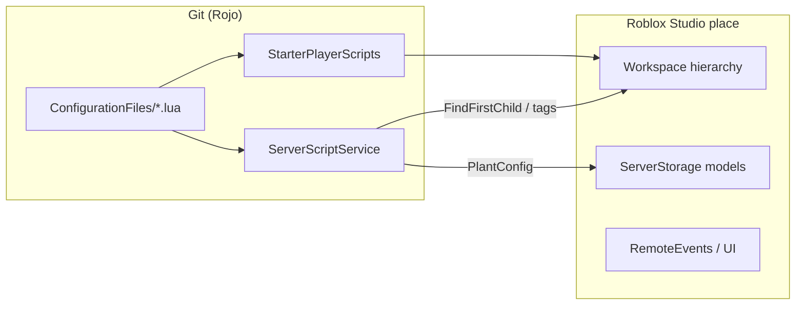

# Environment & World-Building Audit

**Audience:** environment artists, level designers, technical artists  
**Date:** July 2026  
**Repo scope:** Lua/config in git; **all 3D world art lives in Roblox Studio** (place ID `108617605497926`).

This document maps what the **code expects in Workspace**, which systems are **procedural or config-driven**, and where **gaps** exist for a production world-building pipeline.

**See also:** [`zunda-design-bible.md`](zunda-design-bible.md) — full asset catalog, gameplay loop, zone alignment map, and expansion playbook.

---

## Executive summary

| Area | Maturity | Artist action |
|------|----------|---------------|
| Sky / day-night / weather | **Strong** — config + runtime spawn | Tune `SkyConfig.lua`; place `Terrain` with `Clouds` |
| Post-FX (bloom / sun rays / grade) | **New** — `PostFXConfig` + `AtmospherePostFX` | Tune presets; test mobile quality gates |
| Gather / mine / plant respawns | **Medium** — Studio-placed nodes + tags | Tag nodes; set attributes; models in `ServerStorage` |
| Zones / teleporters / buildings | **Medium** — named instances + config | Follow naming contract below |
| Plots / decorations | **Weak** — config exists, placement thin | Signs required; decoration shop not fully wired |
| Terrain / macro layout | **Studio-only** — no gen pipeline | Sculpt in Studio or use BlenderSync greybox |
| Asset version control | **None in git** | Models stay in place; consider `assets/` + LFS later |

**Bottom line:** The game has solid **atmospheric procedural systems** (sky, weather, clouds, constellation spawn) but **no terrain or prop placement pipeline in git**. World art is a **Studio contract** enforced by script `FindFirstChild` / CollectionService tags — not by Rojo.

---

## Architecture split

---

## Required Workspace hierarchy

Scripts assume these **names and locations**. Renaming without code changes will break gameplay.

### Top-level folders / instances

| Path | Used by | Purpose |
|------|---------|---------|
| `Workspace.Terrain` | `CloudController` | Volumetric clouds (`Terrain:FindFirstChildOfClass("Clouds")`) |
| `Workspace.GameplayLoopArea` | Harvest, gather, companion mesh | Main loop island; contains `GatheringNodes` |
| `Workspace.GameplayLoopArea.GatheringNodes` | `ZundaGatherServer`, `HarvestController` | Click-to-gather resource nodes |
| `Workspace.GameplayLoopArea.GatheringNodes.Loop_AppleTree_1.mesh.zundapal` | `CompanionManager` | MeshPart template for companion clones |
| `Workspace.Zones` | `ZoneEntranceScript` | Zone entrance models with `ClickDetector`s |
| `Workspace.TeleporterPads` | `TeleporterManager` | Models `TPad_village`, `TPad_kitchen`, `TPad_eastpeaks`, `TPad_mystic` |
| `Workspace.ZoneAssets.GuestTemplate` | `GuestManager` | NPC template model |
| `Workspace.Guests` | `GuestManager`, `ServingSystem` | Runtime folder for spawned guests (created if missing) |
| `Workspace.PlotSign_1` … `PlotSign_4` | `PlotManager` | Claimable plot signs (`BasePart` + `SurfaceGui` + `ClickDetector`) |
| `Workspace.GrandCafe_Interior` | `BuildingManager` | Interior shell for cafe |
| `Workspace.KitchenWorkshop_Interior` | `BuildingManager` | Interior shell for kitchen |
| `Workspace.BakeryStall_Interior` | `BuildingManager` | Interior shell for bakery |
| `Workspace.BlenderSync` | `BlenderSync` | Runtime folder for Blender greybox parts (auto-created) |
| `Workspace.Constellations` | `DayNightSky` | **Recreated at runtime** — do not hand-author |
| `Workspace.AuroraFX` | `DayNightSky` | **Recreated at runtime** — do not hand-author |

### Door parts (descendants allowed)

`BuildingManager` finds doors by **global name** (`FindFirstChild(name, true)`):

| Door part name | Interior folder |
|----------------|-----------------|
| `GrandCafe_Door_Main` | `GrandCafe_Interior` |
| `KitchenWorkshop_Door_Main` | `KitchenWorkshop_Interior` |
| `BakeryStall_Door_Main` | `BakeryStall_Interior` |

Spawn/return positions are in `BuildingConfig.lua` (designer-tunable).

### Teleporter pads

Under `Workspace.TeleporterPads`, each pad is a **Model** named per `TeleporterConfig.pads`:

- `TPad_village`, `TPad_kitchen`, `TPad_eastpeaks`, `TPad_mystic`
- Each needs a `BasePart` (or child `Part`) for position; `ClickDetector` added at runtime if missing

### Plot centers (hardcoded)

`PlotManager` uses fixed centers (Y ≈ -509). Signs should sit near:

| Plot | Vector3 |
|------|---------|
| 1 | `(145, -509, -420)` |
| 2 | `(165, -509, -420)` |
| 3 | `(145, -509, -440)` |
| 4 | `(165, -509, -440)` |

---

## CollectionService tags

| Tag | Apply to | Behavior |
|-----|----------|----------|
| `Planter` | Parts/models | Grow loop (`Planters.server.lua`), harvest validation, sky tint sync |
| `Plantable` | Soil/plot parts | Paired with planters for planting |
| `Mineable` | Rock/ore nodes | Mining tools, respawn, loot tiers |
| `GuestSpawn` | BaseParts | Overrides default guest queue positions |
| `Tool` | Tool instances | Local tool discovery |
| `Destroy` | Mineable (optional) | Parent model hidden on depletion instead of regen |
| `{PlayerName}\|{Tier}` | Mineable (runtime) | Per-player mining claim (added by `Tools.server.lua`) |

**Mineable type:** tag name must match a key in `MineableConfig.Mineables` (e.g. `Rock`, `MarbleRock`, `GoldRock`).

**Gather nodes:** use `ClickDetector` + attributes on parts under `GatheringNodes`:

- `ResourceType` — e.g. `ZundaFlower`, `ZundaPea`, `MysteryNode`
- `Available` — boolean gate
- `Yield` — optional stack size

---

## Procedural & dynamic systems

### 1. Day / night / sky (`DayNightSky` + `SkyConfig`)

- **14 keyframes** interpolate ambient, fog, atmosphere, exposure
- **12-minute** real-time day (`SkyConfig.cycle.minutes_per_day`)
- Destroys/rebuilds `Lighting` `Atmosphere` and `Sky`
- **Spawns constellations** as neon `Part` stars from `SkyConfig.constellations` (positions are procedural)
- **Spawns aurora curtains** under `Workspace.AuroraFX` for aurora weather
- Reads `workspace` attributes: `WeatherHaze`, `WeatherDensityMult`, `WeatherFogMult`, `CurrentWeather`

**Artist:** tune colors in `SkyConfig.lua`; optional skybox texture fields (currently empty strings). Do not manually place constellation models.

### 2. Weather (`WeatherSystem` + client `WeatherClient`)

- Weighted random from `SkyConfig.weather_pool` (aurora night-only)
- Sets workspace attributes; fires `RemoteEvents.WeatherChanged`
- Client: camera-following particle rig, aurora overlay, lightning strobes, ambient sounds

**Artist:** adjust weights and atmosphere multipliers in `SkyConfig.weather_types`; no particle assets in git.

### 3. Clouds (`CloudController`)

- Tweens `Terrain.Clouds` cover/density/color by weather + hour (dawn/dusk boost, night thinning)

**Artist:** ensure **Terrain** has a **Clouds** instance in Studio.

### 4. Planter color sync (`SkySync`)

- Tints tagged `Planter` / flower parts under `GameplayLoopArea` based on `WeatherFogMult`

**Artist:** keep planters under `GameplayLoopArea` for sync.

### 5. Mining respawn (`Mineable.server.lua`)

- Health/respawn from `MineableConfig`; nodes regrow after timer
- Studio placement + tags; not scatter-generated

### 6. Gathering respawn (`ZundaGatherServer`)

- Per-type respawn seconds (hardcoded in script); fade/shrink on pickup

**Designer gap:** respawn times should move to config for easier tuning.

### 7. Crop growth (`Planters.server.lua` + `PlantConfig`)

- 1 Hz growth loop on tagged planters
- Stage models from **`ServerStorage.Plants`** (not in git)

**Artist:** plant models live in Studio `ServerStorage.Plants`.

### 8. Guests (`GuestManager`)

- Clones `ZoneAssets.GuestTemplate` to `Guests` folder
- Spawn at `GuestSpawn` tags or fallback vectors near serving loop

### 9. Companions (`CompanionManager`)

- Clones mesh from gather area tree or **sphere fallback** if path missing

**Artist:** keep `zundapal` mesh path valid for on-brand companions.

### 10. Blender greybox (`BlenderSync`)

- `_G.applyBlenderSync(snapshot)` ingests block primitives from Blender
- Default origin `(0, -519, -440)`, scale 4 studs/meter
- Parts parented to `Workspace.BlenderSync`

**TA workflow:** external Blender → execute Luau in Studio; **not documented in repo** — candidate for `docs/blender-sync.md`.

---

## Config-driven content (designer-editable in git)

| Config | World-facing content |
|--------|----------------------|
| `SkyConfig.lua` | Day length, keyframes, weather types, constellation layouts |
| `TeleporterConfig.lua` | Zone network, pad names, fade timing |
| `BuildingConfig.lua` | Building metadata, door names, interior folders |
| `MineableConfig.lua` | Node health, respawn, loot tables, sell prices |
| `PlantConfig.lua` | Growth times → `ServerStorage.Plants` model refs |
| `DecorationConfig.lua` | Garden/cottage catalog (`modelName` strings) |
| `HarvestConfig.lua` | Harvest timing / validation (used by `HarvestController`) |
| `ProgressionConfig.lua` | Guest limits, pacing |

---

## Decoration & plot pipeline (gaps)

| Feature | Config | Server placement | Status |
|---------|--------|------------------|--------|
| Plot claim | — | `PlotManager` + signs | **Works** |
| Garden/cottage decor | `DecorationConfig` | — | **Catalog only** — `owned_decorations` in `PlayerDataService`, no placer script found |
| Shop kitchen equipment | `ShopConfig` | — | Model names referenced; Studio assets |

**Recommendation:** add `DecorationPlacer` service that clones models from `ServerStorage.Decorations` (or `ReplicatedStorage`) by `modelName`, with plot bounds from `PLOT_CENTERS`.

---

## What artists edit vs what designers tune

| Edit in Studio | Tune in config (git) |
|----------------|----------------------|
| Terrain sculpt, materials, static meshes | Weather weights, sky keyframes |
| Building exteriors/interiors, door CFrames | Teleporter zone list, building display names |
| Gather node positions, mine rock placement | Mineable health/loot/respawn |
| Guest template appearance | Guest spawn caps (`ProgressionConfig`) |
| `ServerStorage.Plants` growth models | `PlantConfig` grow times |
| Teleporter pad art | Pad names must match `TeleporterConfig` |
| Plot sign visuals | Guest thresholds for unlock (hardcoded in `PlotManager`) |

---

## Zone / narrative entrances

`ZoneEntranceScript` maps `Workspace.Zones/<ZoneModel>/.../ClickDetector` → `ShowZoneVN` BindableEvent. Zone model **Name** becomes the VN key.

**Artist:** each zone is a model under `Zones/` with entrance parts using `ClickDetector`s.

---

## Risks & recommendations

### High priority

1. **Publish a Studio checklist** — duplicate this doc's hierarchy table into a one-page `studio-world-contract.md` for level locks.
2. **Document BlenderSync** — origin, scale, and snapshot format for greybox iteration.
3. **Centralize respawn timers** — gather + plot requirements into config modules.

### Medium priority

4. **`ServerStorage` manifest** — list required models (`Plants`, decoration `modelName`s, tools).
5. **Optional `assets/` + Git LFS** — for reusable rbxmx kits (props, gather nodes) without full place export.
6. **Implement decoration placement** — close the loop on `DecorationConfig` + `owned_decorations`.

### Low priority / defer

7. **Wally** — only when importing external Luau libraries.
8. **Terrain generation** — not in scope; Studio terrain or BlenderSync blocks suffice for this genre.

---

## Quick validation (playtest)

After world changes in Studio:

1. Rojo sync connected; no script errors on boot
2. `Terrain.Clouds` exists; clouds move with weather
3. `GameplayLoopArea/GatheringNodes` nodes clickable; respawn after timeout
4. Tagged `Mineable` nodes mineable with correct tool tiers
5. `GuestTemplate` spawns guests; `GuestSpawn` tags override positions
6. All four `TPad_*` pads teleport
7. Three building doors enter correct `_Interior` folder
8. `PlotSign_1`–`4` show claim UI and respond to clicks
9. `Zones/` entrances open VN on click
10. Companion follows player (mesh or sphere fallback)

---

## Related docs

- [`rojo-workflow.md`](rojo-workflow.md) — code vs Studio split
- [`toolchain.md`](toolchain.md) — Rokit, lint, sourcemap
- [`procedural-building-tools.md`](procedural-building-tools.md) — Studio plugins & GitHub world-gen tools for environment artists
- [`remotes.md`](remotes.md) — networking surface
- [`legacy-notes.md`](legacy-notes.md) — vendor scripts (`qTexture`, `Package`, etc.)
