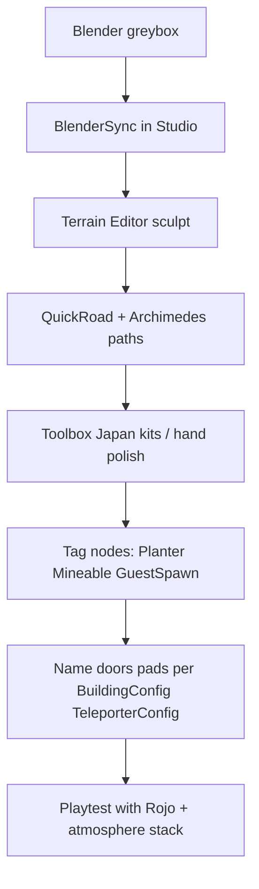

# Procedural Building & World Tools for Zundamon's kItchen

**Audience:** environment artists, level designers  
**Context:** This game is **Rojo-first** — world geometry stays in Studio; code drives atmosphere, tags, and gameplay contracts ([`environment-audit.md`](environment-audit.md)).

This doc catalogs **procedural / semi-procedural tools** useful for expanding the Zunda village, kitchen loop, and plots — with a focus on what fits a **cozy Japanese life-sim** (not open-world survival).

---

## How this project already builds worlds

| Tool | Location | Use |
|------|----------|-----|
| **BlenderSync** | `BlenderSync.server.lua` | Greybox blocks from Blender → `Workspace.BlenderSync` |
| **Studio manual art** | Published place | Buildings, `GameplayLoopArea`, plots, NPC template |
| **Config placement** | `BuildingConfig`, `TeleporterConfig`, `PlotManager` | Door names, pad names, plot centers — not mesh generation |
| **DayNightSky / weather** | `src/` | Atmosphere only; does not place geometry |

**Gap:** No in-repo procedural **building** pipeline yet. Tools below fill that gap in Studio.

---

## Recommended stack for Zunda (by task)

| Task | First choice | Why |
|------|------------|-----|
| Greybox layout | **Blender** + existing `BlenderSync` | Already in project; fast iteration |
| Curved paths / torii arcs | **Archimedes 3** (free) | Roof curves, garden paths |
| Roads between zones | **QuickRoad** (free) | Spline roads without part spam |
| Terrain macro shape | **Terrain Editor → Generate** (built-in) | Hills/marsh around village |
| Island / noise terrain | **Island Generator** (Creator Store plugin) | Perlin islands if you want water surround |
| Real-world reference import | **WorldLoader** (OSM) | Layout reference only — restyle to fantasy Japan |
| Parametric props (fences, shelves, stairs) | **ProceduralModel** (Studio beta) | Official; Rojo-friendly generators later |
| Full biome sandbox (not recommended for main place) | **Gzeu/roblox-procedural-worlds** | Separate experimental place; medieval bias |
| Japanese kitbash | **Toolbox / itch.io packs** | HWK low-poly Japan, torii/minka kits |
| Atmosphere sky (not buildings) | **Atmos** (paid) or custom skybox in `SkyConfig` | You already have code-driven sky |

---

## Tier 1 — Use now (low risk, high fit)

### Blender + BlenderSync (in repo)

- **Workflow:** Block out in Blender → export snapshot → `_G.applyBlenderSync(snapshot)` in Studio
- **Default origin:** `(0, -519, -440)`, scale `4` studs/meter
- **Best for:** Kitchen loop layout, plot boundaries, teleporter pad positions before art pass

### Roblox Terrain Editor (built-in)

- **Docs:** [Environmental terrain](https://create.roblox.com/docs/parts/terrain)
- **Generate tool:** Biomes (Hills, Plains, Marsh) for backdrop mountains / river beds
- **Import:** Heightmap + colormap ZIP if using external generators
- **Zunda note:** Ensure `Terrain` has **Clouds** (required by `CloudController`)

### Archimedes 3 (free plugin)

- **DevForum:** [Introducing Archimedes 3](https://devforum.roblox.com/t/introducing-archimedes-3-a-building-plugin/1610366)
- **Use:** Smooth arcs — torii curves, canal edges, rounded cafe awnings
- **Caution:** High part count if overused; prefer Blender for large curves

### QuickRoad (free plugin)

- **DevForum:** [QuickRoad](https://devforum.roblox.com/t/2024127)
- **Use:** Paths between `TPad_*` zones and `GameplayLoopArea`
- **Pairs with:** `TeleporterConfig` pad names in Workspace

### Building Tools by F3X (free)

- **Creator Store:** [Building Tools by F3X](https://www.roblox.com/library/144950355/)
- **Use:** Precision move/resize/weld in Studio after procedural layout
- **Standard** for most Roblox environment teams

### Roblox ProceduralModel (Studio beta)

- **Docs:** [Procedural models](https://create.roblox.com/docs/parts/procedural-models)
- **DevForum:** [Introducing Procedural Models](https://devforum.roblox.com/t/studio-beta-introducing-procedural-models-build-parametrized-3d-models-with-code-or-ai/4592056)
- **Use:** Parametric fences, lantern rows, plot boundary markers, repeating window bays
- **Future:** Generator `ModuleScript`s could live under `src/` when runtime generation is needed
- **Prompt examples:** "wooden japanese fence with spacing attribute", "stone lantern path with count attribute"

---

## Tier 2 — Situational (evaluate in side place)

### WorldLoader (OSM import)

- **GitHub:** [Klingaac/WorldLoader-Roblox-Plugin](https://github.com/Klingaac/WorldLoader-Roblox-Plugin)
- **Creator Store:** [WorldLoader](https://create.roblox.com/store/asset/76005743851966/WorldLoader-Import-Real-life-places)
- **Docs:** [DevForum documentation](https://devforum.roblox.com/t/worldloader-plugin-documentation/3187419)
- **Generates:** Terrain elevation, roads, railways, building footprints from OpenStreetMap
- **Zunda fit:** Reference layout for zone distances — **replace** OSM buildings with minka/cafe kits; not literal real-world Japan
- **License:** MIT (plugin); map data is OSM-licensed

### Island Generator (Creator Store)

- **Asset:** [Sothaereos Island Generator](https://create.roblox.com/store/asset/13457406181/Sothaereos-Island-Generator)
- **Generates:** Smooth Perlin noise islands
- **Zunda fit:** Mystic Forest / Eastern Peaks backdrop if you want coastal or floating-island fantasy

### Terrainio (web / paid)

- **Site:** [terrainio.com](https://terrainio.com/)
- **Generates:** AI-described terrain → `.rbxlx` or heightmap ZIP
- **Zunda fit:** Quick "misty valley with cherry hills" block-in; hand-edit in Studio after import
- **Not in git:** Export stays Studio-side

### Part to Terrain (JA community)

- **Guide:** [Part to Terrain プラグイン](https://forthechildren.space/part-to-terrain/)
- **Use:** Convert block volumes to smooth terrain (ponds, stepped hills)
- **Good for:** Garden ponds near plots

---

## Tier 3 — Experimental / wrong genre (fork a test place)

### Gzeu / roblox-procedural-worlds (GitHub)

- **Repo:** [Gzeu/roblox-procedural-worlds](https://github.com/Gzeu/roblox-procedural-worlds)
- **Site:** [roblox-procedural-worlds.vercel.app](https://roblox-procedural-worlds.vercel.app)
- **Features:** Biomes, rivers, dungeons, `VillageGenerator`, chunk streaming, `--format rojo` export
- **Why cautious:** Survival/medieval defaults; heavy systems vs. your fixed kitchen loop
- **How to try:** Clone repo → generate in empty place → steal **river carving** or **structure placer** ideas only

### WorldLoader EditableModules

- Customize building footprint modules for **single-story minka** instead of modern boxes
- Document custom modules in Studio; do not commit OSM-derived meshes to git without license review

---

## Paid / polish plugins (atmosphere & workflow)

| Plugin | Price | Role |
|--------|-------|------|
| [Atmos](https://devforum.roblox.com/t/443339) (Elttob) | ~$30 | Skybox + lighting presets — overlap with your `SkyConfig` / `PostFXConfig`; use only if artists want faster iteration than config |
| [NodeGraph](https://devforum.roblox.com/t/nodegraphv20-create-connected-networks-of-nodes-easily/2865840) | Free | 3D node paths for guest routes / zone tours |
| [Axis Indicator](https://github.com/DonKingFrog/Axis-Indicator) | Free | Blender-like transform gizmo |

Curated list: [loominatrx/useful-roblox-resources](https://github.com/loominatrx/useful-roblox-resources) (Plugins → Building Plugins)

---

## Japanese / 和風 asset sources (non-procedural kits)

| Source | Type | Notes |
|--------|------|-------|
| [HWK Studio — Low Poly Japan Pack](https://hwk-studio.itch.io/low-poly-japan-assets-roblox) | `.rbxl` kit | Torii, minka, bamboo — style reference |
| Creator Marketplace | Search: `japanese`, `sakura`, `torii`, `minka`, `zen garden` | Verify no malicious scripts |
| Toolbox (Studio) | Filter **Models**, high favorites | Skyboxes: `anime sky`, `pastel sunset` → paste IDs into `SkyConfig.sky` |

**Art direction:** [和風配色](https://uto-room.com/color/pattern/japan/) · [桜グラデーション](https://uto-room.com/color/pattern/sakura-gradient/)

---

## Zunda-specific workflow (suggested)

1. **Block** village in Blender → sync to `BlenderSync`
2. **Sculpt** terrain around loop; add `Clouds`
3. **Place** kit pieces (cafe, workshop, plots); align to `PlotManager` centers
4. **Tag** interactables per [`environment-audit.md`](environment-audit.md)
5. **Tune** `SkyConfig` skybox IDs + `PostFXConfig` when art is in place
6. **Do not** commit `.rbxl` exports — keep art in published place

---

## What we do not recommend

| Tool / approach | Reason |
|-----------------|--------|
| External HLSL / ReShade injectors | Not shippable to players |
| HttpGet shader repos in production | Security + breakage |
| Full `roblox-procedural-worlds` in main place | Genre mismatch; perf / scope |
| WorldLoader buildings as final art | Wrong architectural language without heavy edit |
| Committing generated `.rbxlx` to git | Violates Rojo-first policy |

---

## Related docs

- [`environment-audit.md`](environment-audit.md) — Workspace naming contract
- [`atmosphere-polish-plan.md`](atmosphere-polish-plan.md) — Sky, weather, post-FX roadmap
- [`rojo-workflow.md`](rojo-workflow.md) — What stays in Studio vs `src/`
