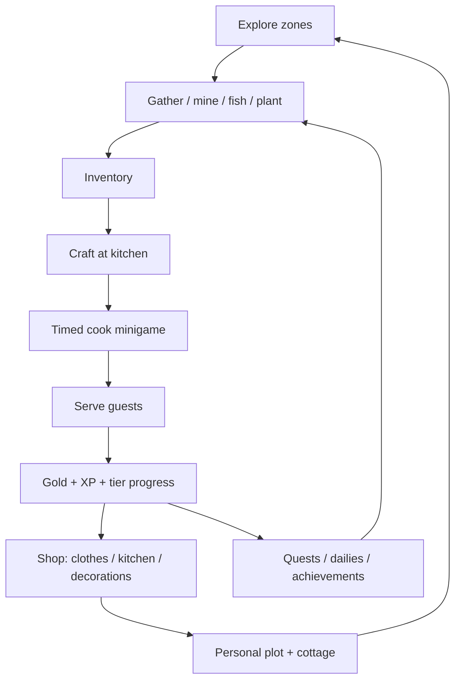

# Zunda Design Bible

**Audience:** environment artists, level designers, gameplay designers, content authors  
**Date:** July 2026  
**Place ID:** `108617605497926`  
**Repo:** `Zundamons-kItchen-GitHub-Build/` (code + config in git; 3D art in Studio)

This document locks in the **Zunda asset catalog**, **core gameplay loop**, **zone vocabulary**, and a **simple expansion playbook**. Use it when adding recipes, decorations, gather nodes, quests, or world zones without re-reading the whole codebase.

**Related docs:** [`environment-audit.md`](environment-audit.md) (Workspace contract), [`atmosphere-polish-plan.md`](atmosphere-polish-plan.md) (sky/weather), [`procedural-building-tools.md`](procedural-building-tools.md) (Studio plugins).

---

## Design pillars

| Pillar | Expression in game |
|--------|-------------------|
| **Cozy loop** | Gather → craft → serve → earn → decorate / claim plot |
| **Zunda identity** | Pea greens, sakura pink, stone lanterns, shrine calm, playful companions |
| **Low-friction expansion** | Most content = one config row + optional Studio model |
| **Japanese village fantasy** | Kitchen court, promenade stalls, hilltop shrine, mystic forest, ancient ruins |
| **Co-op friendly** | Shared world, personal plots, concurrent guests (max 3) |

---

## Core gameplay loop

**Session hooks (already wired):**

- **Guests** spawn every 30–60s; patience ~45s (`ProgressionConfig.guest_settings`)
- **Chef levels** 1–30+ with XP from gather/craft/serve (`ChefLevelConfig`)
- **Progression tiers** by guests served: Humble Baker → Royal Chef (5) → Master Chef (20) → Legend (50)
- **Companions** follow player; premium tier grants gold/xp/gather/cook buffs
- **Weather / day-night** changes mood and gather visuals (no gameplay gate yet — easy seasonal hook)

---

## Asset registry (config-driven)

### Recipes (`CraftConfig.lua`) — 12 total

| Recipe | Tier hint | Key ingredients |
|--------|-----------|-----------------|
| Bread | Starter | Wheat |
| Apple Pie | Starter | Apple, Wheat |
| Zunda Bread | 5 guests | Wheat, Apple |
| Royal Stew | 5 guests | Wheat, Apple, Gold |
| Zunda Mochi | 5 guests | **Zunda Pea**, Wheat |
| Edamame Snack | 5 guests | Edamame Pod, Zunda Leaf |
| Fancy Pie | 20 guests | Apple, Wheat, Gold |
| Zundamon's Banquet | 20 guests | Wheat, Apple, Gold |
| Sweet Pea Cake | 20 guests | Sweet Pea, Wheat, Zunda Pea |
| Pea Flower Tea | 20 guests | Pea Flower, Zunda Leaf |
| Ultimate Feast | 50 guests | Wheat, Apple, Gold |
| Zunda Paradise | 50 guests | Zunda Pea, Edamame Pod, Sweet Pea, Pea Flower |

Cook times: 3–20s (`craft.cookingTimes`). Zunda Paradise = longest (20s).

### Gather nodes (`ZundaGatherServer` + Studio attributes)

Place under `Workspace.GameplayLoopArea.GatheringNodes`. Each node needs `BasePart` + `ClickDetector` + `ResourceType` attribute.

| ResourceType | Drops | Default yield | Respawn (s) |
|--------------|-------|---------------|-------------|
| `ZundaFlower` | Zunda Flower | 3 | 25 |
| `ZundaPea` | Zunda Pea | 2 | 35 |
| `Zunda Mushroom` | Zunda Mushroom | 3 | 25 |
| `Zunda Berry` | Zunda Berry | 4 | 20 |
| `Zunda Root` | Zunda Root | 3 | 22 |
| `MysteryLoot` | Random from mystery table | 2–3 items | 90 |
| `SaltedPeaBouquet` | Salted Pea Bouquet | 1 | 45 |
| `EdamamePod` | Edamame Pod | 2 | 30 |
| `ZundaLeaf` | Zunda Leaf | 3 | 22 |
| `SweetPea` | Sweet Pea | 2 | 28 |
| `PeaFlower` | Pea Flower | 2 | 30 |

**Mystery loot pool:** Zunda Flower, Zunda Pea, Gold Ore, Marble Rock, Apple, Wheat.

Studio: add nodes under `GatheringNodes` with matching `ResourceType` attributes.

### Mineables (`MineableConfig.lua` + `Mineable` tag)

| Tag key | Loot examples | Respawn |
|---------|---------------|---------|
| Rock | Rock, Iron Ore | 15s |
| MarbleRock | Marble Rock, Gold Ore | 15s |
| GoldRock | Gold Ore | 15s |
| Wheat | Wheat, WheatSeed | 15s |
| AppleTree | Apple, Wood Log | 15s |
| PineTree | Pine Cone, Wood Log | 15s |
| ZundaMushroom | Zunda Mushroom | 25s |
| ZundaBerry | Zunda Berry | 20s |
| ZundaRoot | Zunda Root | 22s |

Sell prices for Zunda items are in `mineableConfig.priceLists` (e.g. Zunda Mochi 160g).

### Fish (`FishConfig.lua`)

| Fish | Rarity | Gold | Weight |
|------|--------|------|--------|
| Bluegill | 1 | 8 | 30 |
| Carp | 1 | 12 | 25 |
| Trout | 2 | 20 | 18 |
| Pike | 2 | 25 | 12 |
| Salmon | 3 | 50 | 7 |
| Koi | 3 | 60 | 5 |
| Catfish | 4 | 100 | 2 |
| Golden Koi | 5 | 300 | 1 |

### Decorations (`DecorationConfig.lua`)

**Garden** (`modelName` → Studio model):

| id | Name | Price | modelName |
|----|------|-------|-----------|
| pink_tulips | Pink Tulips | 15 | PinkTulips |
| stone_lantern | Stone Lantern | 40 | StoneLantern |
| garden_bench | Garden Bench | 60 | GardenBench |
| fountain | Mini Fountain | 120 | MiniFountain |
| cherry_tree | Cherry Blossom Tree | 200 | CherryTree |

**Cottage / plot:**

| id | Name | Price | modelName |
|----|------|-------|-----------|
| wooden_table | Wooden Table | 30 | WoodenTable |
| bookshelf | Bookshelf | 50 | Bookshelf |
| window_box | Window Flower Box | 35 | WindowBox |
| fireplace | Stone Fireplace | 150 | Fireplace |
| fancy_bed | Fancy Bed | 180 | FancyBed |
| trophy_shelf | Trophy Shelf | 250 | TrophyShelf |

**Gap:** placement works via server remotes; **Studio models** must exist under `ServerStorage.Decorations`. Shop UI still optional.

### Shop (`ShopConfig.lua`)

**Clothing** (6 items, `assetId = 0` placeholders): Chef's Apron, Tall Chef Hat, Royal Chef Outfit, Zundamon Dress, Master Chef Robe, Legend's Crown.

**Kitchen equipment** (`ServerStorage.ShopModels.Kitchen`):

| id | modelName |
|----|-----------|
| fancy_oven | FancyOven |
| flower_vase | FlowerVase |
| chalkboard_menu | ChalkboardMenu |

### Companions (`CompanionManager.server.lua` → `shared.ZundaCompanionCatalog`)

| Key | Tier | Buff |
|-----|------|------|
| zundamon | Free | — |
| zundacat | Free | — |
| zundabunny | Free | — |
| tantanmon | Free | — |
| ankomon | Premium (500 R$) | +15% gold |
| cardamon | Premium | +30% perfect cook window |
| antimon | Premium | +20% extra gather drop |
| sakuradamon | Premium | +25% XP |

Mesh clones from `GameplayLoopArea.GatheringNodes.Loop_AppleTree_1.mesh.zundapal` (sphere fallback if missing).

### Tools (`ToolsConfig.lua`)

Axe, PickAxe, Sickle, FishingRod — each Tier1–3 damage tiers.

### Power-ups (`PowerupConfig.lua`)

Lucky Charm (+gold), Iron Wrist (+gather), Master's Apron (+perfect window) — 90s duration, gold cost.

### Plants (`PlantConfig.lua` + `ServerStorage.Plants`)

| Seed / stage | Grow time | Model in ServerStorage |
|--------------|-----------|------------------------|
| WheatSeed | 5s | Wheat Plant(Young) |
| Wheat Plant(Young) | 5s | Wheat Plant |

Tag planters with `Planter` + `Plantable` CollectionService tags.

---

## Studio asset manifest

Models **must exist in the published place** (not in git). Names are contractual.

### ServerStorage

| Path | Used by |
|------|---------|
| `ServerStorage.Plants.Wheat Plant(Young)` | Plant growth |
| `ServerStorage.Plants.Wheat Plant` | Plant growth |
| `ServerStorage.ShopModels.Kitchen.FancyOven` | Kitchen shop |
| `ServerStorage.ShopModels.Kitchen.FlowerVase` | Kitchen shop |
| `ServerStorage.ShopModels.Kitchen.ChalkboardMenu` | Kitchen shop |
| `ServerStorage.Decorations.*` | `DecorationPlacer` (modelName per `DecorationConfig`) |
| Decoration `modelName`s from `DecorationConfig` | Decoration placer |

### Workspace (critical paths)

See [`environment-audit.md`](environment-audit.md) for full hierarchy. Highlights:

| Path | Purpose |
|------|---------|
| `GameplayLoopArea.GatheringNodes` | Click-to-gather Zunda nodes |
| `Zones/*` | Zone entrance models (ClickDetector → VN lore) |
| `TeleporterPads.TPad_*` | Fast travel (`village`, `kitchen`, `eastpeaks`, `mystic`) |
| `ZoneAssets.GuestTemplate` | NPC guest clone source |
| `PlotSign_1` … `PlotSign_4` | Claimable plots |
| `GrandCafe_Interior`, `KitchenWorkshop_Interior`, `BakeryStall_Interior` | Enterable buildings |

### Guest types (`ProgressionConfig.guest_preferences`)

Hungry Traveler, Royal Noble, Zundamon Enthusiast, Banquet Master — each prefers different recipe tiers.

---

## Zone vocabulary (alignment map)

Three parallel naming schemes exist today. **Unify before adding new zones.**

| Layer | Keys / names | Used by |
|-------|--------------|---------|
| **Teleporter network** | `village`, `kitchen`, `eastpeaks`, `mystic` | `TeleporterConfig`, `QuestManager` hardcoded explore quest |
| **Lore / VN** | `Zone_VillageGate`, `Zone_KitchenCourt`, `Zone_NorthernBridge`, `Zone_MarketPromenade`, `Zone_HilltopShrine`, `Zone_AncientRuins` | `ZoneLoreConfig`, `Workspace.Zones` model names |
| **Quest visit targets** | `Kitchen`, `Pagoda`, `AncientRuins` | `QuestConfig` (`visit_zone` type) |

**Recommended canonical mapping** (design target — not all wired in code yet):

| Lore zone (Studio `Zones/` name) | Teleporter zone | Quest `target_zone` | Biome role |
|----------------------------------|-----------------|---------------------|------------|
| Zone_VillageGate | village | — | Spawn / tutorial |
| Zone_KitchenCourt | kitchen | Kitchen | Main loop hub |
| Zone_MarketPromenade | village or kitchen | — | Shops, stalls |
| Zone_NorthernBridge | eastpeaks | — | Transition / vista |
| Zone_HilltopShrine | eastpeaks | Pagoda | Shrine, aurora views |
| Zone_AncientRuins | mystic | AncientRuins | Endgame lore, rare nodes |

**Known gaps:**

- `zones_visited` is read by `QuestManager` but **never written** by teleporters or zone scripts
- `QuestConfig` (30+ quests) and `QuestManager.server.lua` (4 hardcoded quests) are **two separate systems**
- `visit_zones_unique` quest expects 5 zones; teleporter config defines 4

---

## Progression & retention systems

| System | Config | Notes |
|--------|--------|-------|
| Guest tiers | `ProgressionConfig.milestones` | Unlocks recipes, cosmetics, furniture labels |
| Chef level | `ChefLevelConfig` | XP curve; 5 tier badges |
| Quests (rich) | `QuestConfig.default_quests` | gather/cook/serve/explore/economy/mastery |
| Quests (legacy HUD) | `QuestManager.server.lua` | 4 onboarding quests only |
| Daily quests | `DailyQuestConfig.pool` | 5 rotating metrics + login streak |
| Achievements | `AchievementConfig` | 24+ metrics (serve, combo, gold, tools, dailies) |
| Recipe mastery | implied by achievements | `maxMastery`, `masteredCount` |

---

## Gameplay ideas bank

Ideas ranked by **implementation cost** (S = small, M = medium).

### S — Config-only (no new code)

| Idea | How |
|------|-----|
| **Seasonal weather** | Bump `cherry_blossom` weight in `SkyConfig.weather_pool` for spring event |
| **New Zunda recipe** | Row in `CraftConfig` using existing ingredients |
| **Garden decoration pack** | Rows in `DecorationConfig` + Studio model |
| **Rare fish event** | Temporarily raise Golden Koi `weight` in `FishConfig` |
| **Daily quest variant** | Row in `DailyQuestConfig.pool` |
| **Shrine offering quest** | `QuestConfig` gather quest for Pea Flower at Hilltop Shrine |
| **Mystery node cluster** | Studio-only: 2–3 `MysteryLoot` nodes near ruins |

### S — Studio-only (no code)

| Idea | How |
|------|-----|
| **Edamame patch** | Gather node with `ResourceType` = custom handler *(needs tiny code)* OR mineable tag |
| **Fishing dock** | Water volume + sign; fish system already exists |
| **Lantern path** | Decorative parts along `Zone_NorthernBridge` |
| **Guest spawn variety** | More `GuestSpawn` tagged parts near kitchen |
| **Sakura petal prop** | Custom particle texture in Studio (see atmosphere plan) |
| **6-face skybox** | Upload textures; paste IDs into `SkyConfig.sky` |

### M — Small code (high leverage)

| Idea | How |
|------|-----|
| **Decoration placer** | Read `owned_decorations`, spawn `modelName` at plot snap grid |
| **Unified zone tracking** | Teleporter + zone entrance write `zones_visited` / fire quest progress |
| **Merge quest systems** | `QuestManager` reads `QuestConfig` instead of hardcoded `QUESTS` |
| **Gather respawn config** | Move `RESPAWN_*` constants from `ZundaGatherServer` to `HarvestConfig` |
| **Seasonal recipe gate** | `CraftConfig` optional `season` or `event_active` flag |
| **Zunda ingredient vendor** | NPC sells Pea Flower / Edamame when gather nodes are sparse |

### M — World / content packs (Studio + config)

| Idea | Contents |
|------|----------|
| **Mystic Forest expansion** | Zunda mushroom rings, `MysteryLoot` grotto, tantanmon cameo NPC |
| **Eastern Peaks mine** | GoldRock cluster, shrine vista, aurora lookout |
| **Market day** | Extra stall props on promenade, limited `ShopConfig` rotation |
| **Ancient Kitchen dungeon** | Interior zone, Ultimate Feast altar, one-time lore VN |
| **Co-op rush hour** | Temporary `max_guests_at_once = 5` via `ProgressionConfig` event flag |

### L — Larger (defer unless requested)

- Full housing editor with rotate/snap
- Player-run stall economy
- Procedural forest scatter from git pipeline
- Cross-server plot persistence

---

## Easy expansion playbook

### Add a new recipe (5 minutes)

1. Add row to `CraftConfig.recipes` and `craft.cookingTimes`
2. Optional: `ProgressionConfig.recipe_unlock_costs` + milestone unlock
3. Optional: guest preference in `ProgressionConfig.guest_preferences`
4. Optional: cook quest in `QuestConfig.default_quests`

### Add a new gather node (15 minutes)

1. In Studio: `BasePart` under `GatheringNodes`, set `ResourceType`, `Available=true`, optional `Yield`
2. Add `ClickDetector` (MaxActivationDistance ~16)
3. If new type: add `elseif` branch in `ZundaGatherServer` *(or generalize to config table later)*

### Add a new decoration (20 minutes)

1. Model in Studio matching `modelName`
2. Row in `DecorationConfig.garden_items` or `cottage_items`
3. When placer exists: no further code; until then, manual plot dressing in Studio

### Add a new fish (5 minutes)

1. Row in `FishConfig.fish` with `weight` (lower = rarer)
2. `FishConfig.difficulty[rarity]` already covers minigame tuning

### Add a new zone (1–2 hours)

1. Model under `Workspace.Zones` with name matching `ZoneLoreConfig` key
2. ClickDetector on entrance pad → fires VN via `ZoneEntranceScript`
3. Optional teleporter pad in `TeleporterConfig.pads`
4. Lore lines in `ZoneLoreConfig`
5. Visit quest in `QuestConfig` with aligned `target_zone`
6. **Wire zone visit** into player data for quest progress

### Add a new companion (30 minutes)

1. Entry in `CompanionManager` `COMPANIONS` table (emoji, glow, buff)
2. If premium: DevProduct in `CompanionShopServer` + `RobuxStoreServer`
3. Keep `zundapal` mesh path valid or accept sphere fallback

---

## Content backlog (prioritized)

| Priority | Item | Type | Why |
|----------|------|------|-----|
| P0 | Zone name unification doc → code | Tiny code | **Partial** — `ZoneVisitConfig` maps lore/quest → canonical keys |
| P0 | `zones_visited` writer on teleport/enter | Tiny code | **Done** — `ZoneVisitServer`, teleporter + lore entrances |
| P1 | `DecorationPlacer` service | Small feature | **Done** — buy/place remotes; needs `ServerStorage.Decorations` models |
| P1 | Edamame / Pea Flower gather nodes | Studio + code | **Handlers done** — place nodes in Studio with ResourceType attrs |
| P1 | Skybox + sakura petal assets | Studio art | Atmosphere phase 1/3 |
| P2 | `QuestManager` → `QuestConfig` merge | Refactor | Single quest source of truth |
| P2 | Gather respawn → `HarvestConfig` | Config move | Designer tuning without code |
| P2 | Clothing `assetId` fill-in | Studio/catalog | Shop placeholders at 0 |
| P3 | Market day event (weather + shop rotation) | Config event | Live ops template |
| P3 | Mystic Forest content pack | World art | Uses eastpeaks/mystic teleporter zones |

---

## Zunda aesthetic reference (environment)

| Element | Direction |
|---------|-----------|
| **Palette** | Pea green `#8CFF9E`, sakura pink `#FFB7C5`, warm wood, stone grey, shrine violet accents |
| **Props** | Stone lanterns, torii hints, wooden stalls, cherry trees, low fog at dawn |
| **Audio mood** | Soft wind, kitchen sizzle, shrine bells (Studio assets) |
| **Lighting** | `SkyConfig` 和風 keyframes + `PostFXConfig` hour bands — tune, don't fight |
| **Avoid** | Custom HLSL shaders (not shippable on Roblox); neon cyberpunk breaks fantasy |

---

## Quick reference: config file index

| File | Content type |
|------|--------------|
| `CraftConfig.lua` | Recipes, cook times |
| `MineableConfig.lua` | Mining nodes, sell prices |
| `FishConfig.lua` | Fish table, rarity difficulty |
| `DecorationConfig.lua` | Garden/cottage catalog |
| `ShopConfig.lua` | Clothing + kitchen equipment |
| `ItemConfig.lua` | Item metadata (partial registry) |
| `PlantConfig.lua` | Crop growth stages |
| `QuestConfig.lua` | Full quest definitions |
| `DailyQuestConfig.lua` | Daily rotation + login bonus |
| `AchievementConfig.lua` | Achievement metrics |
| `ProgressionConfig.lua` | Tiers, guests, unlocks |
| `ChefLevelConfig.lua` | Level curve, XP rewards |
| `ZoneLoreConfig.lua` | VN dialogue per zone |
| `TeleporterConfig.lua` | Fast-travel network |
| `SkyConfig.lua` | Day/night, weather, particles |
| `PostFXConfig.lua` | Bloom, sun rays, color grade |
| `PowerupConfig.lua` | Temporary buffs |
| `ToolsConfig.lua` | Tool damage tiers |
| `HarvestConfig.lua` | Harvest validation timing |

---

## Changelog

| Date | Change |
|------|--------|
| 2026-07-05 | Initial design bible — asset registry, loop, expansion playbook, zone alignment |
